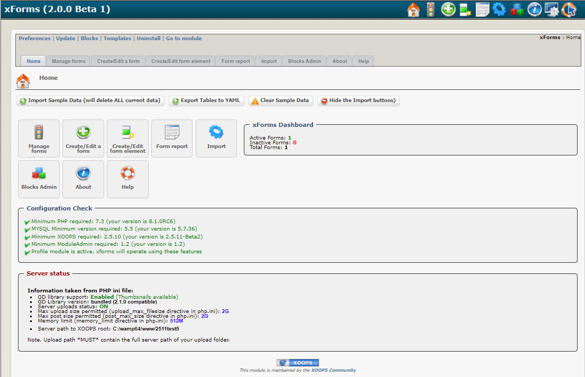

### _XOOPS Documentation Series_

# Module xForms
#### for XOOPS 2.5.10+

#### for PHP 7.2+
      

            
## User Manual

© 2021 XOOPS Project ([www.xoops.org](https://xoops.org))  

## Module Purpose

xForms is a module for XOOPS to offer widely customizable web forms.

This module allows the generation of different kinds of form elements e.g. text areas, check boxes for webmasters to create their "Contact Us" forms. Submitted information can be sent by email or through the private message system of XOOPS, and received by selected user group(s).

**Some of the functions include:**

* Ability to record data in the database.
* Sending email (copied configurable) and private message
* Management of attached files and images (including downloaded)
* Multiple configurations form (descriptions, shipping methods, etc.).
* Generation of reports for saved forms
* Set start and end dates of validity

*Figure 1: Main view of the xLanguage Module (Admin side)*

## Download/Fork the Module  

**You can fork the module --> [here](https://github.com/XoopsModules25x/xforms))** 

## How to Contribute

[You can contribute on GitHub](https://github.com/XoopsDocs/xforms-tutorial). Changes will be [pushed to Gitbook.io automatically](https://xoops.gitbook.io/xforms-tutorial/activity) when the [main repository](https://github.com/XoopsDocs/xforms-tutorial) changes.

Editing the book can be done either by updating the markdown files with a text editor, or opening the repository in [the Gitbook desktop app](https://github.com/GitbookIO/editor/blob/master/README.md). The desktop app will give you a live preview option.

# Table of Content

* [Install/Uninstall](book/1install.md)
* [Administration Menu](book/2administration.md)
* [Preferences](book/3preferences.md)
* [Operating Instructions](book/4operations.md)
* [The User Side](book/5userside.md)
* [Blocks](book/6blocks.md)
* [Templates](book/7templates.md)
* [Miscellaneous](book/8other.md) 
* [Module Credits](book/9credits.md)
* [About XOOPS CMS](book/10aboutxoops.md)

## License:

 Unless specified, this content is licensed under a <a rel="license" href="http://creativecommons.org/licenses/by-nc-sa/4.0/">Creative Commons Attribution-NonCommercial-ShareAlike 4.0 International License</a>.

All derivative works are to be attributed to XOOPS Project ([www.xoops.org](https://xoops.org))
