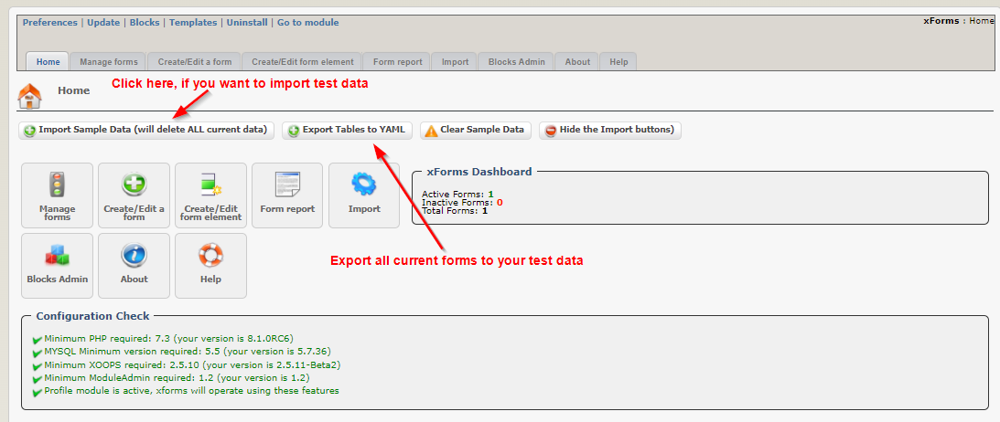
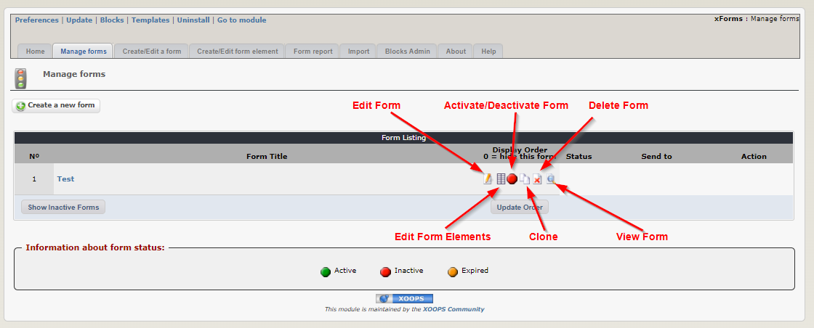
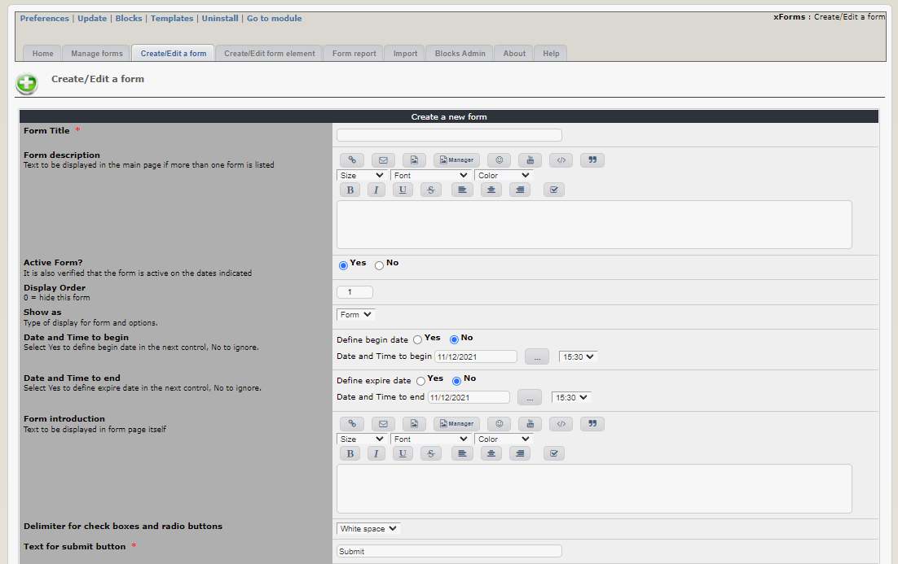
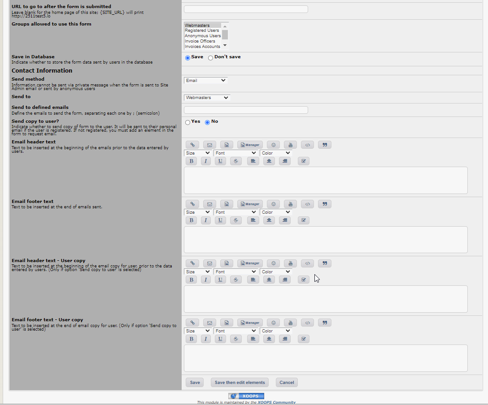
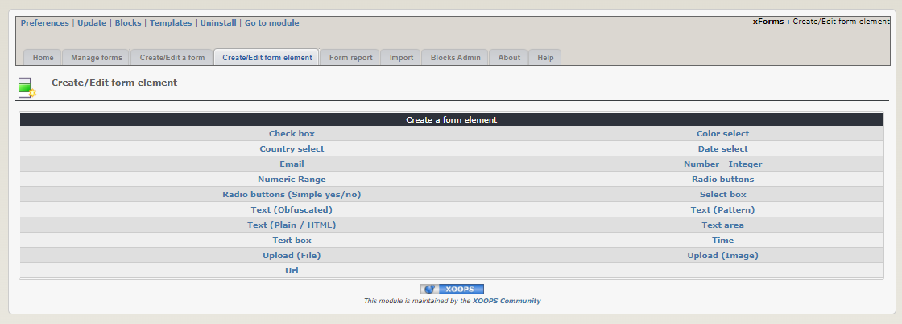
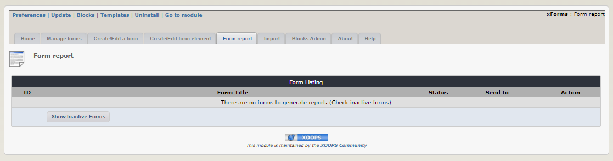
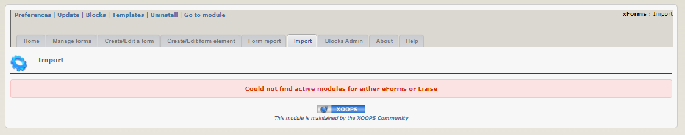
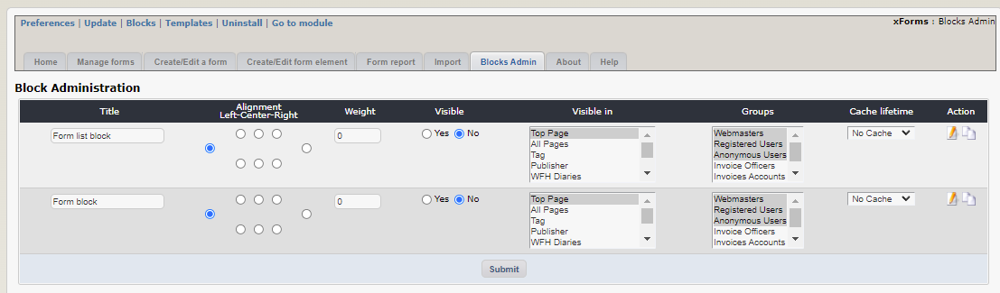
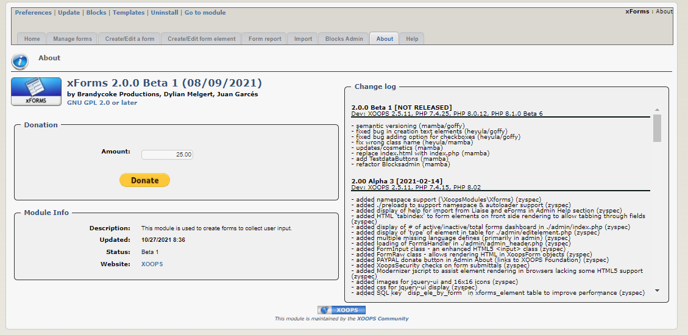

# 2.0 Administration Menu

_Figure 2: Admin menu of the xForms Module_

In the menu you can do following:

* Import forms from Testdata
* Save existing forms as Testdata (e.g. forlater testing)
* Create new forms and edit existing ones
* Manage existing forms
* Create/Edit form elements
* Create Form reports
* Import Forms from other modules
* Set Blocks

You can also learn more about the module by looking at the "About" tab, and at the "Help" tab.
## Import Sample Forms

## Manage Forms

## Create/Edit Form 

## Create/Edit Form Elements

## Form Reports

Here you can see the form reports of the form existing forms.

## Import Forms from other modules

If there are active modules that xForms could import forms from, you can see them in the "Import Forms" tab.

## Blocks Administration

Here you can manage the blocks that are used in the forms.

## About xForms

