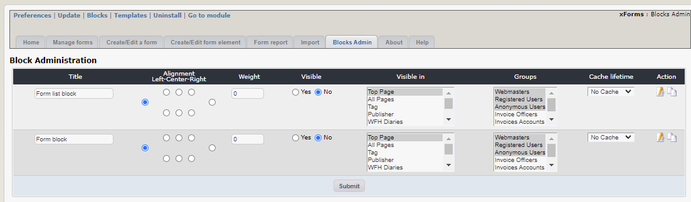
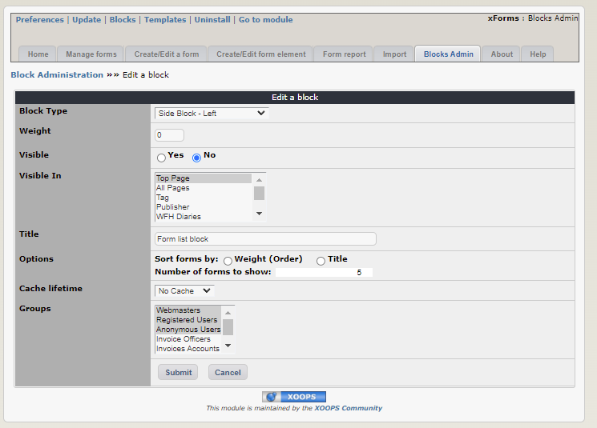
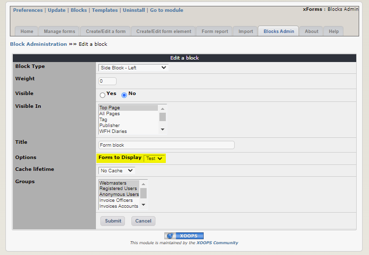

# 6.0 Blocks

There are two blocks in the XForms tutorial:
* List of forms
* Individual form

For each block, you can define where will the block be displayed, and who will be able to see it.

You can also clone a block and customize it.

The "List of forms" Block will show you all the forms. Here you can set how many forms should be shown on one page, and how they should be sorted.

In the second block you can select which form you want to see:

